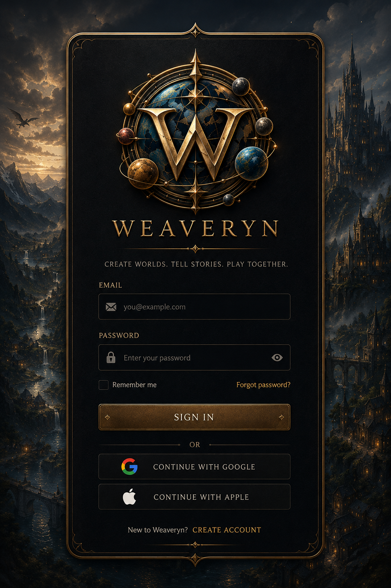
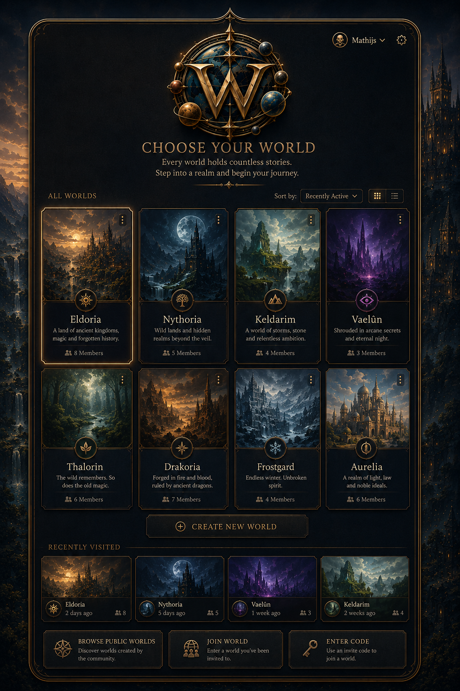
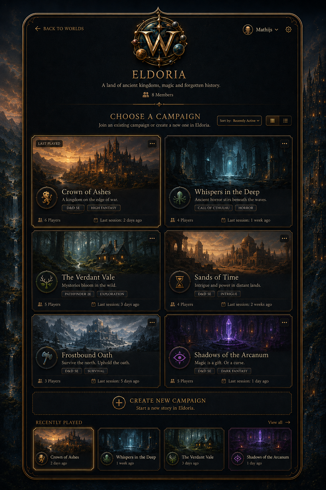
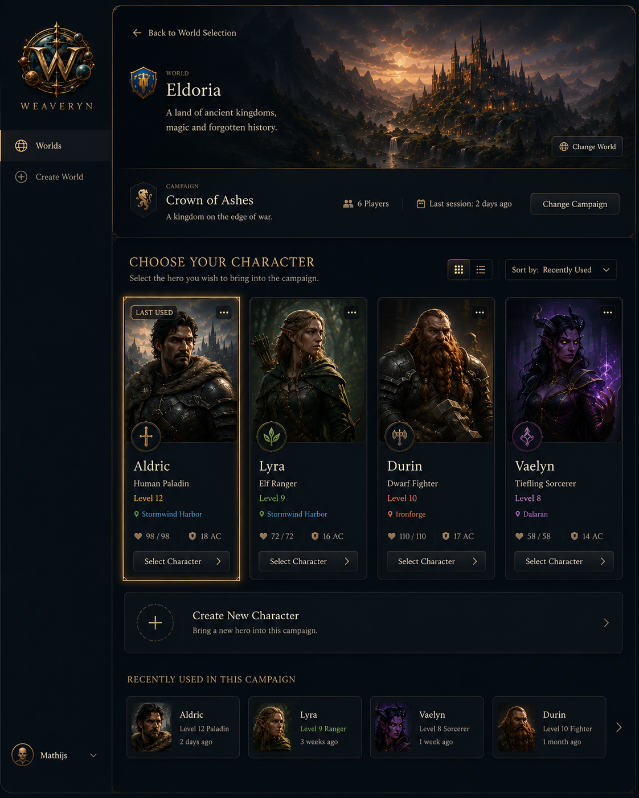

# Weaveryn

> **An open-source platform for creating worlds, running campaigns, and playing tabletop role-playing games.**

> [!IMPORTANT]
> **Weaveryn is currently in early development.**  
> Features and UI concepts described here represent the intended direction of the project and may not yet be implemented.

Weaveryn aims to bring **worldbuilding, campaign management, characters, rules, maps, lore, notes, gameplay tools, and optional AI assistance** together in one extensible platform.

The goal is not to build another character sheet or campaign wiki.

The goal is to build a place where you can **create a world, define how it works, run multiple campaigns inside it, and enter those campaigns through your characters.**

---

## The Vision

A Weaveryn game is structured around **Worlds**, **Campaigns**, and **Characters**.

```text
World
│
├── World Rules
│   ├── Species
│   ├── Languages
│   ├── Currencies
│   ├── Cultures
│   ├── Calendars
│   └── Setting Concepts
│
├── Campaign
│   ├── Campaign Ruleset
│   ├── Player Characters
│   ├── NPCs
│   ├── Sessions
│   ├── Locations
│   └── Campaign Content
│
└── Campaign
    ├── Different Campaign Ruleset
    ├── Different Characters
    └── Different Story
```

A **World** defines the setting.

A **Campaign** represents a game being played inside that world.

A single world can contain multiple campaigns, and those campaigns do not have to use the same tabletop RPG mechanics. This allows a world to remain persistent while different stories, groups, and game systems exist within it.

An active campaign belongs to one world and is not intended to move freely between worlds. Campaign ownership remains independent from world ownership. An active campaign keeps its World relationship, and the containing World cannot be deleted while active campaigns still depend on it.

---

## Designed to Feel Like Entering a World

Weaveryn should not feel like opening business software.

The interface is intended to take inspiration from games: **atmospheric, visual, and centered around the worlds, campaigns, and characters you are about to play.**

After signing in, the primary navigation flow is intended to follow the structure of Weaveryn itself:

```text
Login
  ↓
Choose World
  ↓
Choose Campaign
  ↓
Choose Character
  ↓
Enter Campaign
```

A **World** is the first level of selection because it defines the setting in which campaigns exist.

After selecting a world, the user chooses one of the campaigns available within that world. The selected campaign determines the applicable campaign ruleset, members, characters, and gameplay context.

Finally, the player selects the character they want to use in that campaign.

This creates a game-like entry experience rather than presenting the user with a traditional application dashboard.

### Login Concept



> **Concept artwork — not yet implemented. Final UI may differ.**

The first MVP implements email-and-password registration and login. The social-login and password-recovery controls shown in the concept are later capabilities.

### World Selection Concept



The world-selection screen is the main entry point after authentication.

From here, users can:

- Enter an existing world
- Create a new world
- Access worlds shared with them
- Manage worlds they own
- Quickly return to recently visited worlds

### Campaign Selection Concept



After entering a world, the user chooses a campaign within that world.

A campaign determines the active game context, including:

- Campaign ruleset
- Game Masters
- Players
- Player Characters
- NPCs
- Sessions
- Campaign-specific content

Users with the appropriate permissions can also create a new campaign within the selected world.

### Character Selection Concept



After selecting a campaign, players choose the character through which they want to enter the game.

From here, a player can:

- Select an existing character
- Create a new character for this world/campaign
- Use an existing compatible character
- View basic character information
- Continue into the campaign

Character creation is both **world-aware and campaign-aware**.

The World determines setting concepts such as available species, cultures, languages, and origins. The Campaign ruleset determines game mechanics such as attributes, classes, skills, abilities, and progression.

> **Concept artwork — not yet implemented. Final UI may differ.**

## Worlds

Worlds are persistent settings that can contain multiple campaigns.

A world can define concepts such as:

- Species and peoples
- Languages
- Currencies
- Cultures
- Calendars
- Locations
- Maps
- Lore and world knowledge
- Setting-specific concepts
- World-level rules and definitions

World rules answer the question:

> **What exists in this world, and how does the setting work?**

A world can then contain multiple campaigns using those shared concepts.

---

## Campaigns

A campaign represents a particular game or story taking place inside a world.

Each campaign can have its own tabletop RPG mechanics while continuing to use the setting defined by its world.

Planned campaign functionality includes:

- Campaign-specific rulesets
- Players and Game Masters
- Membership and permissions
- Sessions
- Campaign notes
- Journals
- Maps and locations
- Player Characters
- NPCs
- Campaign-specific content

This means two campaigns inside the same world could potentially use completely different RPG systems.

For example, one campaign could use a d20-based system while another campaign in the same world uses a narrative ruleset.

---

## Characters

Characters are persistent user-owned identities that can exist across worlds and campaigns.

Weaveryn separates a character into three conceptual layers:

```text
Character
    ↓
WorldCharacter
    ↓
CampaignCharacter
```

- **Character** — portable identity, portrait, personality, and core backstory
- **WorldCharacter** — world-specific identity such as species, culture, hometown, and world history
- **CampaignCharacter** — campaign-specific game state such as level, class, stats, equipment, and progression

This allows the same character to participate in multiple campaigns without duplicating their core identity.

For example, Bodwick can be level 8 in a D&D 5e campaign and level 4 in a Pathfinder campaign while remaining the same character in the same world.

A Character has at most one WorldCharacter in a particular World. The same portable Character concept can also be used in another World by creating a separate WorldCharacter. Bodwick in World X and Bodwick in World XY therefore remain linked to the same Character concept, while their species, hometown, relationships, and histories may differ. World-specific references are explicitly mapped or replaced when creating the new incarnation.

Planned functionality includes:

- Character creation
- Character sheets
- Attributes and stats
- Skills
- Abilities
- Spells
- Inventory
- Custom fields
- Portrait upload
- Character selection
- Campaign association
- Ruleset-aware character creation
- Future modular 2D/2.5D avatar creation
- Reuse a WorldCharacter across multiple campaigns
- Independent character progression per campaign
- Copy characters between worlds
- Migrate characters between worlds

### Character Visuals

The initial implementation can use:

- An uploaded character portrait
- A simple blank paper-doll/full-body representation

This keeps the first implementation practical while leaving room for a more advanced modular avatar system later.

A future avatar system may allow interchangeable visual components such as:

- Hair
- Face
- Skin tone
- Build
- Clothing
- Armor
- Accessories

The intended direction is a more grounded **2D/2.5D visual style**, rather than requiring full 3D characters or animated game sprites.

---

## NPCs

NPCs are intended to be first-class entities rather than simple text notes.

Planned functionality includes:

- NPC profiles
- GM-only stat blocks by default
- Optional player visibility
- Optional player control
- Reusable NPCs
- Clone NPCs into other worlds
- Convert NPCs into Player Characters

When converting an NPC into a Player Character, Weaveryn should support two approaches:

**Promote**

The NPC becomes a Player Character and the original NPC is archived.

**Copy**

A new Player Character is created while the original NPC remains available.

Because Player Characters may use different or more detailed rules than NPCs, conversion may require assigning additional character statistics.

---

## Rulesets

Weaveryn is not intended to be tied to a single tabletop RPG system.

Rulesets should be **modular, importable, customizable, and data-driven** rather than having one game's mechanics hardcoded into the application.

Weaveryn distinguishes between two broad categories of rules.

### World Rules

World rules describe the setting itself.

Examples include:

- Species
- Languages
- Currency
- Cultures
- Calendars
- Setting concepts

### Campaign Rules

Campaign rules describe how the tabletop game is played.

Examples include:

- Attributes
- Skills
- Dice mechanics
- Combat mechanics
- Character progression
- Abilities
- Spells
- Equipment mechanics
- Other system-specific rules

Users should eventually be able to:

- Select an existing ruleset
- Import a ruleset
- Customize a ruleset
- Create a ruleset from scratch

When creating a **World**, users can select, customize, or import world rules.

When creating a Character within a campaign, Weaveryn combines the selected World's setting definitions with the Campaign's ruleset.

World-specific identity belongs to the character's World incarnation, while ruleset-specific statistics and progression belong to its Campaign participation.

Different campaigns in the same world may use different rulesets. The same WorldCharacter can therefore have different mechanics and progression in each campaign.

---

## Worldbuilding

Weaveryn should connect world information rather than storing everything as isolated notes.

Planned worldbuilding functionality includes:

- Locations
- Maps
- Lore
- NPCs
- Organizations
- Notes
- Images
- Linked entities
- Map checkpoints
- Relationships between world objects

The goal is for information to become interconnected so that characters, locations, NPCs, campaigns, and lore can reference one another.

---

## Gameplay

Planned gameplay tools include:

- Dice rolling
- Quick-reference information
- Interactive maps
- Locations and checkpoints
- Character abilities
- Spells
- Inventory
- Session management
- GM tools
- Player permissions
- Battle maps
- Optional projector/tabletop interface

The tabletop/projector interface is considered a secondary feature rather than a requirement for the initial release.

---

## Solo Play

Weaveryn is also intended to support solo tabletop play.

Future functionality may include:

- A dedicated solo-play interface
- Journaling
- Character interaction
- Campaign context management
- Optional AI-assisted Game Master functionality

Solo play should use the same underlying worlds, campaigns, characters, rulesets, and content as multiplayer campaigns rather than becoming a separate application.

---

## Optional AI

AI support should be **optional and provider-independent**.

Core Weaveryn functionality should never require an AI provider.

The long-term architecture should allow users to choose between:

- Local AI models
- Cloud AI providers
- No AI at all

Potential AI functionality includes:

- Game Master assistance
- Rules lookup
- Campaign summarization
- NPC assistance
- Worldbuilding assistance
- Solo-play Game Master functionality
- Natural-language interaction with campaign data

An API-oriented architecture should allow authorized AI agents to read and write relevant Weaveryn data while respecting user, campaign, and Game Master permissions.

---

## Permissions

Weaveryn uses layered permissions so access can be controlled at the world, campaign, character, and content level.

The permission model is intended to support concepts such as:

- **Users**
- **World Owners**
- **World Members**
- **Campaign Owners**
- **Campaign Members**
- **Dungeon Masters / Game Masters**
- **Players**
- **Character Ownership**
- **DM/GM-only Information**
- **Player-only Information**
- **Shared Information**
- **Player-controllable NPCs**

### World Permissions

A **World Owner** has administrative control over the World, including its configuration, members, and World-level content. The World owner also controls whether a Campaign may be hosted in the World, but does not automatically control the Campaign's independently owned content, membership, gameplay, or lifecycle.

**World Members** can be given access to the world without necessarily participating in every campaign within it.

Initial World roles are `ADMIN`, `MEMBER`, and `VIEWER`. Campaign owners and members may also select a World containing their Campaign without automatically becoming World members or receiving general World editing rights.

### Campaign Permissions

A **Campaign Owner** manages a specific campaign within a world.

Campaign ownership is independent from World ownership. A World owner controls whether a Campaign may exist within their World, but does not automatically own or gain deletion authority over Campaigns owned by other users.

Campaign members can have different roles, including:

- Game Master (`GM`)
- Assistant Game Master (`ASSISTANT_GM`)
- Player (`PLAYER`)
- Spectator (`SPECTATOR`)

The Campaign owner always has the functional `GM` role. Campaign ownership may be transferred by the current owner without granting that authority to the World owner.

### Characters and NPCs

Player Characters can be owned or controlled by specific players.

NPCs are normally controlled by the DM/GM, but individual NPCs can optionally be delegated to one or more players.

This allows a player to temporarily or permanently perform actions for an NPC without exposing unrelated DM/GM-only information.

### Information Visibility

Campaign and world content can have different visibility levels, including:

- **World** — visible to the World owner and World members
- **Campaign** — visible to members of a selected Campaign
- **GM** — visible to the Campaign owner, GM, and Assistant GM
- **Player** — visible to a selected player
- **Private** — visible only to the creator/owner

Permissions should be applied to the underlying information rather than relying solely on hiding elements in the user interface.

Sensitive information such as hidden NPC statistics, unrevealed lore, secret locations, and GM notes should remain inaccessible unless explicitly shared or delegated.

### Destructive Actions

Destructive actions such as deletion should be deliberate user-interface actions with appropriate permission checks and confirmation.

They should not be casually exposed through the public API.

A World cannot be deleted while it contains any active Campaign. Campaign owners must end or delete their own active Campaigns before World deletion can proceed, and a World owner cannot delete another user's Campaign merely because it is hosted in their World.

If a World owner wants to leave while active Campaigns remain, they may transfer or relinquish World ownership. Relinquishment leaves the World available with the same identity and Campaign relationships so active Campaigns can continue, and eligible users may claim the orphaned World according to the ownership lifecycle rules.

Deleting a World after no active Campaigns remain must still preserve independently user-owned Characters and handle any inactive or archived user-owned content through an explicit lifecycle workflow.

Ended or archived Campaigns are preserved using a limited immutable World snapshot before they are detached from a deleted World. Account deletion likewise requires the user to resolve owned Worlds, Campaigns, and Characters explicitly rather than relying on database cascades.

---

## Open and Self-Hostable

Self-hosting is a first-class goal.

Weaveryn is intended to support:

- Local/self-hosted installations
- Community deployments
- A potential hosted service

Users should remain in control of their worlds and campaign data.

The web application should be usable across:

- Desktop
- Tablet
- Phone

The application does not need to be mobile-first, but core functionality should remain practical across these devices.

---

## Community Content

Long term, Weaveryn could provide a library of community-created content such as:

- Rulesets
- Worlds
- Adventures
- NPCs
- Characters
- Maps
- Templates

Free and open content should remain an important part of the ecosystem.

Creators may eventually be able to distribute paid **original content** if they choose, while free community content remains fully supported.

Official copyrighted or licensed third-party content would only be distributed where Weaveryn has the appropriate rights or licensing agreements.

User-created content remains the responsibility of its creator and should be handled through clear content and copyright policies.

---

## Design Principles

Weaveryn is being designed around several principles:

- **Open source first**
- **Self-hosting is a first-class deployment model**
- **AI is optional**
- **AI providers should be interchangeable**
- **Rulesets are data, not hardcoded game logic**
- **World setting rules and campaign mechanics are separate concepts**
- **A world can contain multiple campaigns**
- **An active campaign belongs to one world**
- **Active campaigns prevent their World from being deleted**
- **Campaign ownership is independent from world ownership**
- **Users control their own content**
- **Desktop, tablet, and mobile should all be usable**
- **The interface should feel like entering a game, not opening business software**
- **Third-party copyrighted content is not bundled without appropriate permission**
- **Core functionality should remain useful without paid services**

---

## Current Status

Weaveryn is currently in **early development**.

Current development is focused on the application foundation, including:

- Next.js and TypeScript application foundation
- PostgreSQL and Prisma persistence
- Core domain and data model
- World ownership and lifecycle persistence
- Permissions foundation
- Automated testing foundation
- Application/service architecture

Many features described in this README are part of the **long-term vision and are not implemented yet**.

---

## Roadmap

Development will broadly progress through the following stages:

### Phase 0 — Foundation

- Application architecture
- Database foundation
- Authentication
- Local email-and-password login
- Users
- API architecture
- Ownership
- Permissions
- Testing foundation

### Phase 1 — Worlds & Campaigns

- World creation
- World editing and deletion
- Campaign creation
- Campaign membership
- World membership
- Basic linear World timeline and Campaign timeline position
- World rules
- Campaign rulesets

### Phase 2 — Characters

- World- and campaign-aware character creation
- Character / WorldCharacter / CampaignCharacter model
- Reuse characters across campaigns
- Character copy and migration
- Character creation
- Campaign-aware character creation
- Character sheets
- Portrait upload
- Character selection screen
- Basic paper-doll representation

### Phase 3 — Worldbuilding

- NPCs
- Locations
- Maps
- Lore
- Notes
- Entity linking

### Phase 4 — Gameplay

- Sessions
- Dice
- Abilities
- Spells
- Inventory
- GM tools
- NPC permissions
- Battle-map functionality

### Phase 5 — AI & Solo Play

- AI API
- Local model support
- Cloud provider support
- GM assistance
- Campaign context
- NPC interaction
- Solo-play interface

### Phase 6 — Community

- Import and export
- Shareable content
- Ruleset library
- Community packages

### Future

- Rich modular 2D/2.5D avatar system
- Projector/tabletop interface
- Creator marketplace
- Official licensed content

A more detailed roadmap is tracked in [`ROADMAP.md`](ROADMAP.md), which is currently under development.

---

## Documentation

Project documentation lives under `/docs`.

Current and planned documentation includes:

- [`VISION.md`](docs/VISION.md) — long-term product vision; under development
- [`FEATURES.md`](docs/FEATURES.md) — detailed feature catalogue; under development
- [`ARCHITECTURE.md`](docs/ARCHITECTURE.md) — authoritative domain architecture and invariants
- [`DATA_MODEL.md`](docs/DATA_MODEL.md) — logical entities, relationships, scope, and constraints
- [`MVP.md`](docs/MVP.md) — current MVP implementation scope
- [`TECH_STACK.md`](docs/TECH_STACK.md) — technical stack and runtime architecture
- [`RULESETS.md`](docs/RULESETS.md) — world and Campaign Ruleset architecture; under development
- [`DESIGN-PRINCIPLES.md`](docs/DESIGN-PRINCIPLES.md) — product and interaction design principles; under development
- [`development/SETUP.md`](docs/development/SETUP.md) — development environment and installation; under development
- UI concept documentation and screenshots

---

## Contributing

Weaveryn is currently in an early design and development stage.

Contribution guidelines will be expanded as the architecture stabilizes.

Contributions will eventually be welcome across areas such as:

- Development
- Testing
- Documentation
- UI/UX design
- Ruleset development
- Worldbuilding tools
- Accessibility
- Self-hosting
- Translations

---

## Development

Weaveryn currently uses:

- **Next.js**
- **TypeScript**
- **PostgreSQL**
- **Prisma**

Development setup instructions are tracked in:

[`docs/development/SETUP.md`](docs/development/SETUP.md)

---

## License

Weaveryn is licensed under the **GNU Affero General Public License v3.0 (AGPL-3.0)**. See [`LICENSE`](LICENSE) for the full license text.

---

*Weaveryn is a work in progress. Features, architecture, terminology, and interface concepts described in this repository may change significantly during development.*
