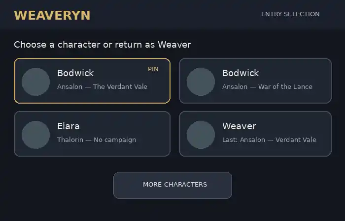
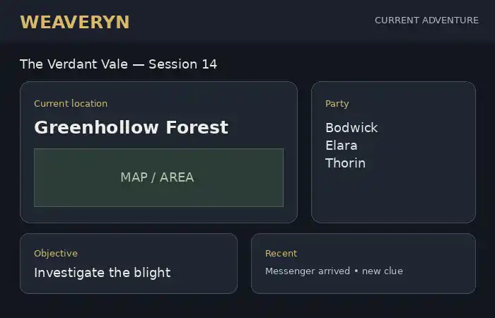
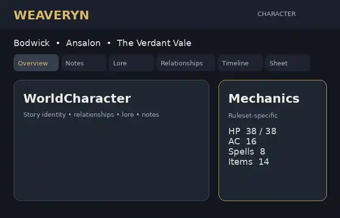
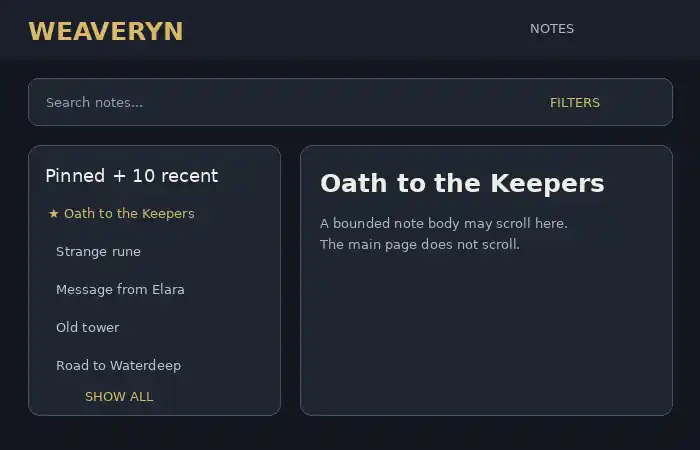

# Weaveryn Vision 2.0

> **Status: Current product vision**  
> **Established: August 2026**

Weaveryn is an open-source, self-hostable platform for creating persistent worlds,
running tabletop role-playing campaigns, and entering those worlds through
characters.

This document is the current source of truth for **long-term product direction,
interaction design, and intended user experience**.

It does not mean every capability described here exists today. For implementation
work:

- `ARCHITECTURE.md` remains authoritative for current domain invariants and
  implemented backend behavior.
- `DATA_MODEL.md` describes the current logical data model.
- `MVP.md` defines what is in the current MVP and what is deliberately deferred.
- This document decides the direction those systems should evolve toward when a
  future product decision conflicts with an older product concept.

Where older product-direction text conflicts with Vision 2.0, **Vision 2.0 wins**.
A technical architecture change required by this vision must still be designed and
implemented explicitly rather than assumed to already exist.

---

## 1. Product principle: immersion without friction

Weaveryn should feel like **entering a living world**, not opening business
software.

At the same time, atmosphere must not make ordinary actions slow or confusing.
The guiding priority is:

> **Immersion and usability both matter. When there is no meaningful usability
> cost, immersion wins.**

Common actions should remain direct. A player who already knows which character
and campaign they want should be able to get back into play with one clear action.
Administrative concepts should appear only when they are useful.

### No scrolling on main pages

A main Weaveryn page should fit inside the available viewport. The page body does
not become a long scrolling document.

When more information exists than fits on the page, use:

- tabs
- fixed panels
- drawers or overlays
- pagination
- search and filters
- a dedicated detail screen
- internal scrolling inside a bounded content area

A note editor, entity description, inventory list, or similar contained panel may
scroll internally. **The main page itself should not scroll.**

This applies across desktop, tablet, and phone layouts. Smaller screens should
recompose the same experience rather than simply creating an endlessly tall page.

---

## 2. Core model: identity, world story, campaign mechanics

The character model remains:

```text
Character
    ↓
WorldCharacter
    ↓
CampaignCharacter
```

Each layer has a different job.

### Character — portable identity

`Character` is the user-owned identity that can be carried between Worlds.

It holds the portable concept of the character: the identity that makes Bodwick
still Bodwick even if a separate incarnation is created in another World.

### WorldCharacter — narrative identity in a World

`WorldCharacter` is the character as they exist in a particular World.

It owns story information that should stay true across Campaigns in that World,
for example:

- world-specific backstory
- scars and lasting narrative changes
- titles
- relationships
- reputation
- personal history
- knowledge and discovered lore
- WorldCharacter notes
- timeline-related memories

If Bodwick participates in two Campaigns in Ansalon, these Campaigns refer to the
same Bodwick-in-Ansalon unless a deliberate timeline branch creates a different
continuity.

### CampaignCharacter — ruleset and gameplay mechanics

`CampaignCharacter` is the mechanical representation of the WorldCharacter in one
Campaign.

It owns data that may differ because Campaigns can use different Rulesets:

- attributes and statistics
- class or equivalent progression
- HP or equivalent resources
- spells
- abilities
- conditions
- equipment and mechanical inventory state
- ruleset-specific character sheet data
- other short-term or system-specific gameplay state

The guiding split is:

> **Narrative identity follows the WorldCharacter. Ruleset-dependent mechanics
> follow the CampaignCharacter.**

An object can have both layers. For example, a legendary sword may be a WorldEntity
with shared lore and history, while its exact damage, tags, charges, or inventory
representation are Campaign/Ruleset mechanics.

---

## 3. Entry experience: choose who you are entering as

The older flow of:

```text
Login → World → Campaign → Character → Play
```

is no longer the desired primary flow.

The primary flow is **character-first**.

After login, the user sees the character/campaign contexts they can enter. A card
represents a specific **WorldCharacter + Campaign** combination.

### Example: one character in two Campaigns

```text
┌─────────────────────────────────┐
│ Bodwick                         │
│ Ansalon — The Verdant Vale     │
└─────────────────────────────────┘

┌─────────────────────────────────┐
│ Bodwick                         │
│ Ansalon — War of the Lance     │
└─────────────────────────────────┘
```

These are two entry cards even though they share the same WorldCharacter.
Clicking either card goes **straight into that Campaign as Bodwick**.

The user should not have to answer World, Campaign, and Character questions again
when the card already provides that context.

### WorldCharacters without a Campaign

A WorldCharacter does not disappear merely because they are not currently in a
Campaign.

Example:

```text
┌─────────────────────────────────┐
│ Elara                           │
│ Thalorin — No campaign         │
└─────────────────────────────────┘
```

Clicking this card opens Elara's WorldCharacter page in Thalorin rather than a
Campaign.

This does **not** grant broad access to World lore. Without a Campaign, Elara sees
her own character information and only World information she is actually allowed
to know.

### Ordering and pinning

The main selection view shows **three cards by default**.

Order is:

1. pinned entry cards
2. then most recently played/used

A pin belongs to the **specific Character + Campaign entry**, not every appearance
of that Character.

For example, a user may pin:

```text
Bodwick — Ansalon — The Verdant Vale
```

without pinning:

```text
Bodwick — Ansalon — War of the Lance
```

### Continue where you left off

There is no separate large "Continue" button competing with the character cards.
Instead, the most recently used Character/Campaign or Weaver card is visually
highlighted so the resume action is immediately obvious.

### More characters

A **More characters** action expands the same selection page to expose the
remaining entries. It does not force the user through a separate selection wizard.

The fixed-page rule still applies: the expanded state must be designed as a bounded
layout rather than a long page body.

### Weaver entry

GM and Assistant-GM style management use one **Weaver** entry rather than separate
GM/Assistant-GM launch buttons.

The Weaver card shows the last managed context and resumes it directly.

Example:

```text
┌─────────────────────────────────┐
│ Weaver                          │
│ Last managed:                  │
│ Ansalon — The Verdant Vale     │
└─────────────────────────────────┘
```

The card also provides a way to switch to another manageable World or Campaign.

### Concept example from the Vision 2.0 review



> **Illustrative concept, not a pixel-perfect UI specification.** The decisions in
> this document are authoritative; labels, artwork, spacing, and exact layout may
> evolve during implementation.

---

## 4. Campaign entry: land in the current adventure

Entering a Campaign as a character should not land on a generic administration
screen or force the player immediately into a full character sheet.

The default Campaign landing page is **session/current-adventure focused**.

It should make the current situation understandable at a glance, using information
such as:

- current location
- current party
- current objective or active threads
- recent events
- relevant map area
- recent notes or discoveries
- quick character status/actions
- shortcuts to the full character page and other Campaign tools

The exact widgets depend on the Campaign and Ruleset, but the purpose remains the
same: **show what matters now**.



> **Illustrative concept.** The session hub is the desired information hierarchy,
> not a requirement to reproduce every widget shown in this image.

---

## 5. Character experience

A WorldCharacter has one consistent outer character experience. Switching Campaign
context should not make the same person feel like an unrelated duplicate.

### Campaign switching

If a WorldCharacter participates in multiple Campaigns in the same World, their
character page has a quick **Switch campaign** control.

Switching Campaign:

- keeps the WorldCharacter identity and shared narrative context
- changes the active Campaign context
- changes the CampaignCharacter mechanics and Ruleset-specific presentation

### Consistent shell, Ruleset-specific mechanics

The character page combines two ideas:

1. the WorldCharacter shell stays recognizable and consistent
2. the mechanical area can change significantly according to the active Ruleset

A D&D-style Campaign might show HP, AC, spell slots, classes, and inventory. A
narrative system might show traits, stress, clocks, or a completely different
sheet structure.



> **Illustrative concept.** Stats and labels shown in the mockup are examples only.
> The important direction is the persistent WorldCharacter shell plus a
> Ruleset-specific mechanical area.

### Tabbed, not vertically stacked

The character page should use tabs/sections such as:

```text
Overview · Notes · Lore · Relationships · Timeline · Character Sheet
```

Tabs that are irrelevant should be hidden rather than occupying space.

This supports the no-main-page-scroll rule and lets each area have a focused job.

### Notes tab

The normal Notes tab should contain:

- a search bar
- filters
- pinned notes first
- then the 10 most recent notes
- a **Show all** action

`Show all` opens a dedicated Notes screen rather than extending the character page
indefinitely.

The dedicated Notes screen also follows the no-main-page-scroll rule. A note list
or note body may scroll inside its own fixed panel.



> **Illustrative concept.** The intended behavior is search/filter/pin/recent/show
> all with internal panel scrolling, not the exact visual styling in the mockup.

---

## 6. Character knowledge is not player knowledge

Weaveryn must distinguish what the **human player knows** from what a
**WorldCharacter knows**.

If a player learned a secret in another Campaign, that does not automatically make
it visible to Bodwick.

Knowledge belongs to the relevant WorldCharacter and continuity.

This is important both for normal UI and future AI assistance: the application
should be able to give a character a view of the World that matches what that
character can actually know.

### Leaving and rejoining a Campaign

If a WorldCharacter leaves a Campaign:

- they keep information they already learned
- they stop automatically receiving new Campaign knowledge

If they later rejoin:

- public/world-level developments that are reasonably known at the new point may
  catch up
- private, secret, character-specific, or selectively shared information does not
  automatically appear
- new private knowledge still requires a reveal/share event

---

## 7. Visibility and privacy: audiences, not only roles

The long-term visibility model is richer than a simple
`WORLD/CAMPAIGN/GM/PLAYER/PRIVATE` list.

Information needs an **audience**.

A player should be able to decide, where appropriate, that a piece of backstory,
note, memory, or other player-owned information is:

- visible to everybody who is otherwise allowed into the context
- visible only to selected people
- visible to everybody except selected people
- visible only to the character owner
- explicitly shared with the DM
- explicitly hidden from the DM

### Example: selective secret

A valid audience can be:

> **Bodwick and Elara know this secret. Thorin and the DM do not.**

The DM role must not silently override this choice.

### Truly private from the DM

If a player chooses **Hide from DM**, the DM must not be able to retrieve that
information through Weaveryn's normal:

- UI
- application API
- search
- exports available to the DM role
- GM tools
- AI tools acting for the DM

This is an authorization rule, not merely a hidden UI element.

The in-game `DM`/`GM` role is different from an infrastructure operator or database
administrator of a self-hosted instance. Vision 2.0 requires **no DM-role override**;
cryptographic privacy from the machine/operator itself would be a separate security
design decision if that requirement is introduced later.

### Private character notes

Players have character notes that are **private by default**.

They may later share an individual note with:

- selected players/characters
- the DM
- another allowed audience

There is no separate player-global notebook in the current direction. Notes are
character-scoped.

For a WorldCharacter participating in multiple Campaigns in the same World, their
WorldCharacter notes remain the same notes across those Campaigns.

### Visibility defaults depend on entity type

There should not be one universal "new content is public" or "new content is
hidden" rule.

Defaults depend on what is being created. For example:

- an ordinary public city/location may reasonably default visible
- an unrevealed secret location may default hidden
- private NPC motives/details may default hidden
- a deliberately public event may default visible to eligible audiences

The default is a convenience. Final authorization still depends on audience,
knowledge, timeline, location, and other applicable rules.

---

## 8. Lore visibility depends on knowledge, time, and location

World lore should not be treated as a wiki that every Campaign member can browse in
full.

A character sees lore according to what they are allowed to know.

Important inputs include:

- explicit DM/reveal decisions
- the WorldCharacter's knowledge
- the Campaign's point in the timeline
- the WorldCharacter's relevant timeline branch
- location when it matters to whether information could have reached them

### Strict future knowledge

Example:

> Bodwick is currently at **Year 124**. An event that happens in **Year 130** is
> not visible to him merely because the event already exists in Weaveryn's World
> database.

The DM may deliberately reveal prophecy, time-travel knowledge, or another special
case, but the existence of future data is not itself permission to see it.

### Location matters

Example:

> A major event happens in Neverwinter while Bodwick is in Waterdeep.

Bodwick does not automatically know about it at the instant it happens. A messenger
could arrive later. A traveler might spread a rumor. Magic could relay the news.
Another character could tell him.

For the near-term implementation, **keep this simple**: the DM controls when the
information becomes known.

A future system may model rumor/news propagation and how quickly information
travels between locations. That is explicitly a future enhancement, not a
requirement for the initial knowledge system.

---

## 9. Shared canon, backstory, and relationships

Players control their own character material unless it changes shared World canon.

### Player-owned story information

A player may create private backstory details, memories, opinions, and other
character material without requiring DM approval simply because a DM exists.

### Shared World canon

If a proposed character fact changes the shared setting, DM approval is required.

Examples might include declaring that the character is the ruler of an existing
kingdom or that an established WorldEntity has a new canonical family relation.

The principle is:

> **Players control their character story. Shared World canon requires the
> authority responsible for that canon.**

### Relationships between player characters

If one player's proposed fact creates a shared canonical relationship with another
player character, the other player must accept it.

Example:

- Bodwick may privately write that he _thinks of Elara as a sister_.
- If Bodwick and Elara are to be canonically siblings, Elara's player must accept
  that shared relationship.

Once both players agree, DM approval is **not** additionally required unless the
relationship also changes wider World canon.

---

## 10. Entity-first worldbuilding

Worldbuilding should remain **entity-first**.

Most things that exist in a World should be able to use a common entity foundation,
including:

- NPCs and people
- locations
- factions and organizations
- items with World identity
- events
- deities
- creatures
- quests or story objects where appropriate
- custom types

Entities can support:

- notes and structured data
- links to other entities
- relationships
- images/assets
- visibility/audience rules
- timeline relevance
- Campaign knowledge about the entity

This creates an interconnected World instead of isolated pages.

Entity-first does not mean every type must have an identical UI or identical
mechanical storage. A location and a deity can use different views; a mechanical
spell may be Ruleset content rather than a WorldEntity. The shared entity model is
for persistent World identity and relationships where that identity is useful.

---

## 11. Timeline-aware Worlds

Time is part of World state, not just text in a campaign note.

Campaigns can exist at different points in the same World history. A character's
visible lore should resolve against the relevant timeline and position.

### Alternate timeline branches

Long term, Worlds support alternate timelines.

A Campaign event can diverge from shared history without forcing every other
Campaign in the World to adopt that outcome.

When a timeline branches, the DM chooses whether that branch is:

- Campaign-only
- promoted/created as a World-level branch usable by other Campaigns

Other branches are **not visible to players by default**. A player sees the branch
they are part of unless the DM explicitly reveals another continuity.

### Character death example

A WorldCharacter death is normally a WorldCharacter-level story event and therefore
matters across Campaigns in the same continuity.

But the DM can mark the death as belonging to an alternate timeline.

Example:

```text
Main timeline
└── Bodwick continues in Campaign B

Alternate Campaign branch
└── Bodwick dies during Campaign A
```

This allows Campaign A's consequences to remain real without automatically killing
Bodwick in a Campaign that follows another branch.

### When a branch splits

The DM chooses whether to:

- keep the same WorldCharacter across the branch while possible
- create a separate timeline version when the continuity needs one

The system should not force duplication at the instant a branch exists.

### Moving a character between branches

If Bodwick moves from one timeline branch to another, he keeps his **personal
history**, while the application only presents World knowledge/events that make
sense in the new branch.

If Bodwick remembers something that never happened in the new branch, the **player
chooses** whether that old-branch memory remains part of Bodwick's personal
experience.

### Timeline UI should reveal complexity only when needed

A timeline-branch indicator on the character page appears only when the World
actually has multiple relevant branches.

A simple World should feel simple.

### Merge wizard

If timeline branches later reconnect, Weaveryn should provide a merge wizard that:

- compares important differences
- highlights conflicting WorldCharacter and World facts
- helps the DM decide which facts become canon
- preserves history rather than silently overwriting one branch

This is a future workflow, but the data model should avoid choices that make it
impossible.

---

## 12. Rulesets: one active Ruleset per Campaign

A Campaign has **one active Ruleset at a time**.

Different Campaigns in the same World can still use different Rulesets.

The Ruleset controls Campaign mechanics such as:

- attributes and skills
- dice mechanics
- combat rules
- progression
- classes/archetypes where applicable
- spells and abilities
- equipment mechanics
- CampaignCharacter sheet structure

World lore and WorldCharacter narrative identity do not become owned by that
Ruleset.

### Custom rulings create a derived Ruleset

A Campaign may start with a standard/default Ruleset.

If the DM makes house rules or rulings that customize that system, the shared
default should not be modified. The Campaign diverges into its own derived Ruleset
or variant.

Example:

```text
D&D 5e
    ↓ campaign customizes rules
The Verdant Vale — D&D 5e (Customized)
```

Future rulings update the Campaign's derived Ruleset.

### Ruleset changes use an assisted migration

Changing Rulesets must never silently reinterpret existing character mechanics.

Weaveryn should keep the old mechanical state and create/prepare the new state.
A conversion wizard can:

- compare old and new mechanics
- suggest equivalent classes, abilities, spells, items, or fields
- automate mappings that are safely understood
- flag ambiguous conversions
- show the player and DM what will change

For a player's CampaignCharacter:

> **Player proposes the converted state → DM approves it.**

The old state remains available as history/reference rather than being destroyed by
the conversion.

---

## 13. AI follows the identity it represents

AI is optional and provider-independent. Core Weaveryn does not require an AI
provider.

More importantly, AI never receives a special "see everything" permission merely
because it is AI.

### Player AI

If an AI is assisting Bodwick, it can receive only information Bodwick is allowed
to know in that context.

The AI does not automatically receive everything the human account may know from
other Characters or Campaigns.

### DM AI

If an AI is assisting the DM, it can receive only information the DM role is
allowed to access.

If a player has information marked **Hide from DM**, the DM's AI cannot see it
either.

### Explicit AI capabilities

Future AI tools should be permission-scoped. A Campaign might allow an AI to:

- help the DM prepare material
- control selected NPCs
- suggest lore or events without publishing them
- summarize information available to its current identity
- propose edits that require approval
- write selected data when explicitly authorized

The safe rule is:

> **AI access is the intersection of the identity's visibility and the AI tool's
> granted capabilities.**

An AI can have less access than the human identity it assists; it must never gain
more.

---

## 14. What is intentionally simple for now

Vision 2.0 contains several long-term capabilities that should not inflate the MVP.
In particular, the following can remain simple or deferred until their foundations
are needed:

- automatic modeling of rumor/news travel speed
- full timeline branch creation and merge workflows
- Ruleset conversion automation
- advanced AI/AI-DM behavior
- broad arbitrary audience grants beyond the current MVP visibility system
- advanced calendar engines
- battlemap/projector experiences
- marketplace/community distribution systems

The architecture should remain compatible with these directions, but **future
compatibility is not a reason to implement the whole future now**.

---

## 15. Product examples

These examples summarize how the major decisions work together.

### Example A — Fast character-first entry

A user has nine playable entries. Three are shown first.

1. pinned entries appear first
2. everything else is ordered by recent use
3. the most recently used entry is visually highlighted
4. `More characters` exposes the remaining entries on the same screen

Clicking:

```text
Bodwick
Ansalon — The Verdant Vale
```

enters The Verdant Vale immediately as Bodwick.

### Example B — Same person, different Campaign mechanics

Bodwick participates in two Campaigns in Ansalon.

His scars, relationships, history, and WorldCharacter notes remain shared because
he is the same person in the same World continuity.

Campaign A may use one Ruleset and Campaign B another. HP, spells, abilities,
stats, and other mechanics therefore come from two separate CampaignCharacters.

### Example C — A secret even the DM does not know

Bodwick writes a private note and shares it only with Elara.

```text
Audience:
✓ Bodwick
✓ Elara
✗ Thorin
✗ DM
✗ DM AI
```

The DM cannot retrieve the note through a GM-only override.

### Example D — Time prevents spoilers

The World database contains an event at Year 130, but Bodwick is playing at Year 124.

The event remains unavailable to Bodwick unless something in the story legitimately
reveals future knowledge.

### Example E — Location delays knowledge

Something important happens in Neverwinter while Bodwick is in Waterdeep. The
event can exist canonically without immediately appearing in Bodwick's Lore tab.
A messenger later reaches Waterdeep, and the DM reveals the knowledge.

### Example F — A Campaign diverges

Bodwick dies in one Campaign, but the DM marks that death as an alternate-timeline
event. Another Campaign continues on a branch where he survived. Players in the
other Campaign do not automatically see that alternate branch.

### Example G — A house rule becomes Campaign-owned

The Verdant Vale starts with a default Ruleset. The DM changes a core ruling.
Weaveryn preserves the default and treats the Campaign's rules as a customized
derived Ruleset from that point onward.

---

## 16. Decision summary

Vision 2.0 establishes these product rules:

1. Entry is character-first, not World-first.
2. A Character + Campaign context is a direct launch card.
3. The same WorldCharacter in two Campaigns appears as two launch cards.
4. WorldCharacters without a Campaign remain selectable and open their character
   page.
5. Weaver is one GM/Assistant-GM entry and resumes the last managed context.
6. Resume/continue is a highlight on the most recent card, not a separate primary
   button.
7. Three character entries are shown first.
8. Entry cards can be pinned; pinning is per Character + Campaign entry.
9. Unpinned entries default to most-recently-played ordering.
10. More characters expands the same selection experience.
11. Clicking a Campaign entry goes directly into the Campaign.
12. A character without a Campaign does not receive broad World-lore access.
13. Future lore is hidden when the character has not reached that point in time.
14. Player-owned information may be truly hidden from the DM role.
15. DM-hidden information is also hidden from the DM's AI.
16. Character notes are private by default and selectively shareable.
17. Players can share information with selected players while excluding the DM.
18. A character leaving a Campaign keeps knowledge already learned.
19. Rejoining can catch up public World knowledge but not private/secret knowledge.
20. Location can affect whether information is reasonably known.
21. Automated news/rumor propagation is a future enhancement; manual reveal is
    sufficient first.
22. Knowledge belongs to a WorldCharacter, not the user account globally.
23. There is no player-global notebook in the current direction.
24. WorldCharacter notes are shared across that character's Campaigns in the same
    World.
25. Lasting narrative changes belong to WorldCharacter and carry across Campaigns
    in the same continuity.
26. Ruleset-dependent mechanics belong to CampaignCharacter.
27. Ruleset changes preserve old state and use an assisted conversion workflow.
28. The player proposes converted character mechanics; the DM approves them.
29. Player story facts need DM approval only when they alter shared World canon.
30. Shared relationships between player characters require the other player's
    acceptance.
31. DM approval for an agreed player relationship is needed only when wider World
    canon changes.
32. Death normally affects WorldCharacter continuity but may belong to an alternate
    timeline.
33. On timeline divergence, the DM chooses whether/when a separate character
    timeline version is required.
34. Timeline branches can later use a merge wizard.
35. A new branch can be Campaign-only or World-level, chosen by the DM.
36. Players do not see other timeline branches unless they are revealed.
37. A character moving between branches keeps personal history while current
    knowledge is resolved for the new branch.
38. The player decides whether contradictory old-branch memories remain part of the
    character's personal memory.
39. Timeline branch UI appears only when multiple branches make it relevant.
40. A multi-Campaign WorldCharacter has a quick Campaign switch.
41. Character pages use a consistent WorldCharacter shell with Ruleset-specific
    Campaign mechanics.
42. Character pages are tabbed.
43. Notes expose search, filters, pinned notes, 10 most recent, and Show all.
44. Main pages never scroll; bounded content panels may scroll internally.
45. Campaign entry lands on a session/current-adventure hub.
46. Worldbuilding remains entity-first.
47. Default visibility varies by entity/content type.
48. Each Campaign has one active Ruleset; customization forks/derives a
    Campaign-specific variant instead of mutating the shared default.
49. AI is permission-scoped and cannot know more than the identity it represents.
50. Immersion and usability are balanced; immersion wins when it does not add
    meaningful friction.

---

## 17. Relationship to current implementation

Vision 2.0 deliberately extends beyond the current MVP.

Do not interpret a future capability in this document as proof that its database
schema, API, authorization model, or UI already exists. When implementing one of
these directions:

1. confirm the current state in `ARCHITECTURE.md`, `DATA_MODEL.md`, and the code
2. update technical documentation when the implementation changes an invariant
3. keep `MVP.md` honest about what is actually in scope
4. preserve backend-enforced authorization for all visibility/privacy behavior
5. add visual acceptance scenarios for user-testable behavior according to the
   development documentation

Vision 2.0 defines **where Weaveryn is going**. The architecture and tests must make
that direction real one coherent feature at a time.
